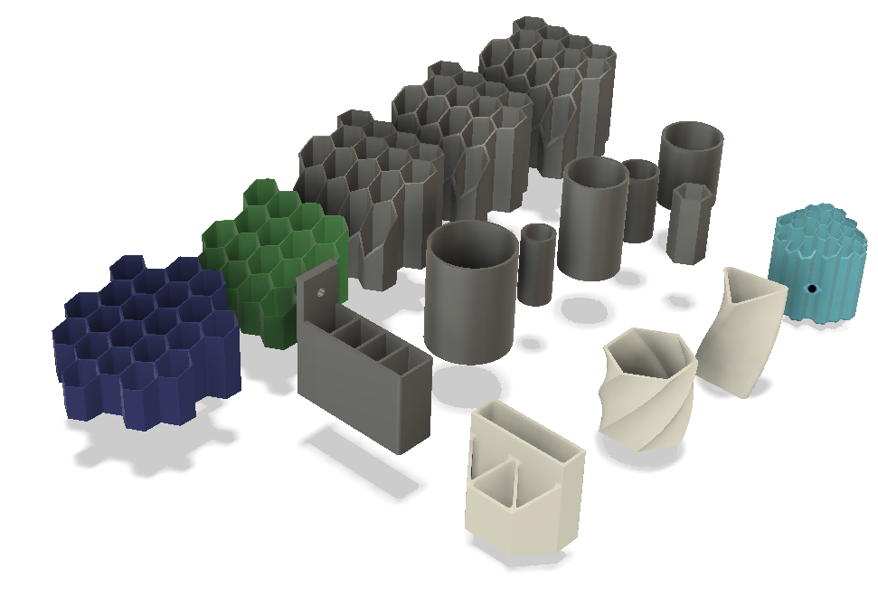
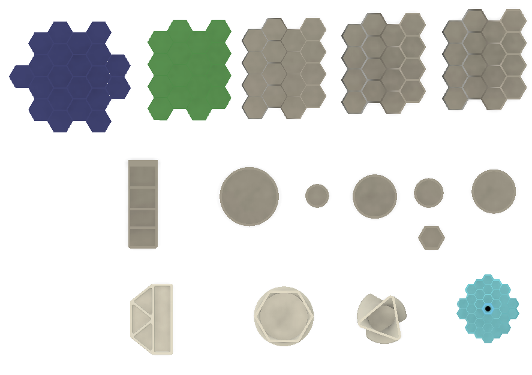
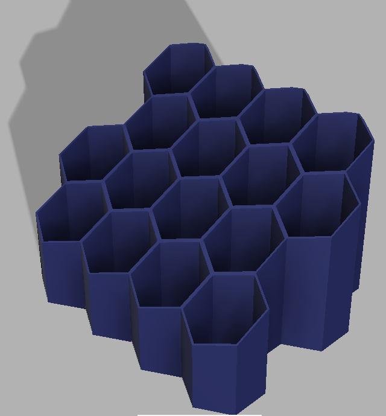

 
 
 

- [summary](summary.md)

# tubeToolHolder
3D printable Tool and Pen holders 

## Timeline
* Design start April 2020
* Major update Sept 2021
* Scateboard, README and photos May 2022

## Printed Hexagons 

----

## Printed TubeToolHolders

----

## All designs in a single fusion 360 asm file

----

----

## Hexagons Gallery

----

----

----

----

----

----

