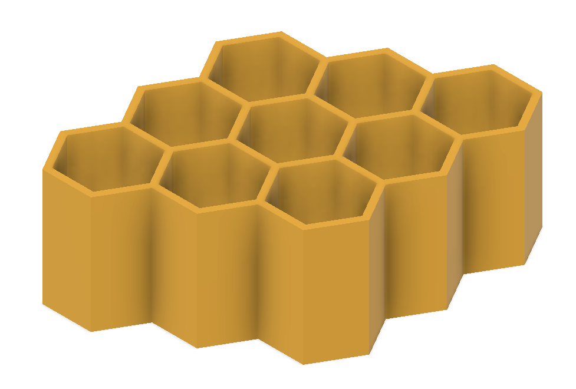
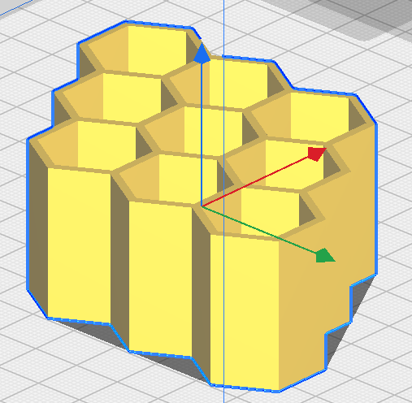
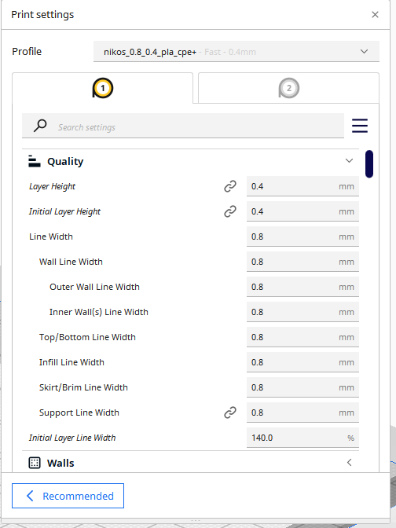
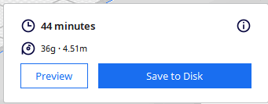
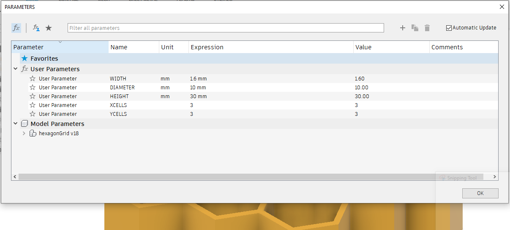
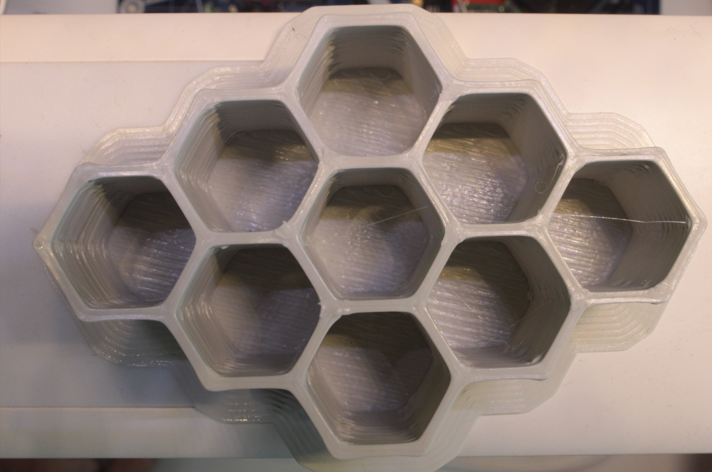
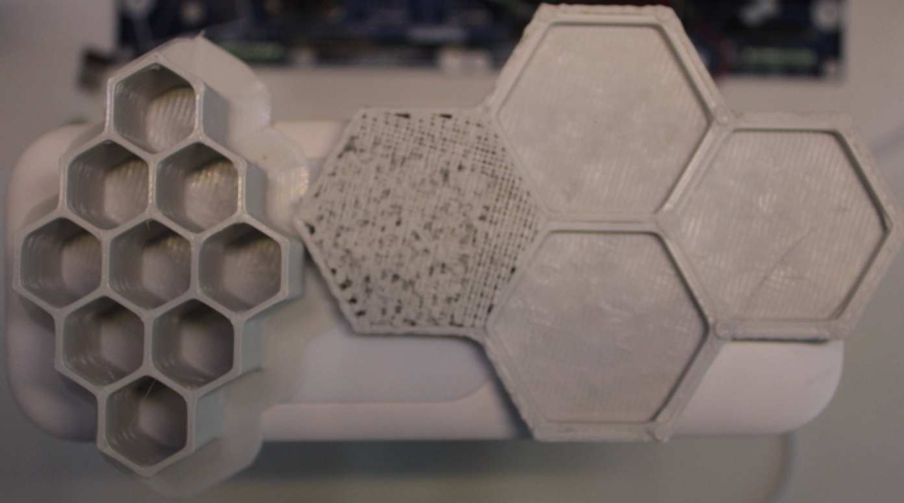
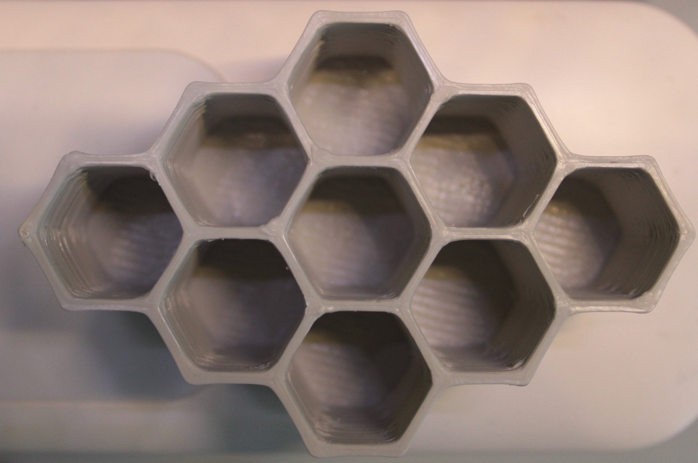

- [back to top](./README.md)

# dev_log

## 01/07/2023

`image 11: hexagonGrid 3D modeling`

----

`image 12: hexagonGrid slicer view`

----

`image 13: hexagonGrid cura parameters`

----

`image 14: hexagonGrid cura statistics`

----

`image 15: hexagonGrid Fusion360 parametric design`

----

`image 16: hexagonGrid V2 3x3 test printout`

----

`image 17: hexagonGrid V1 2x2 and V2 3x3 cells test printouts`

----

`image 18: hexagonGrid V2 3x3 3D printed, brim removed and cleaned`

----
